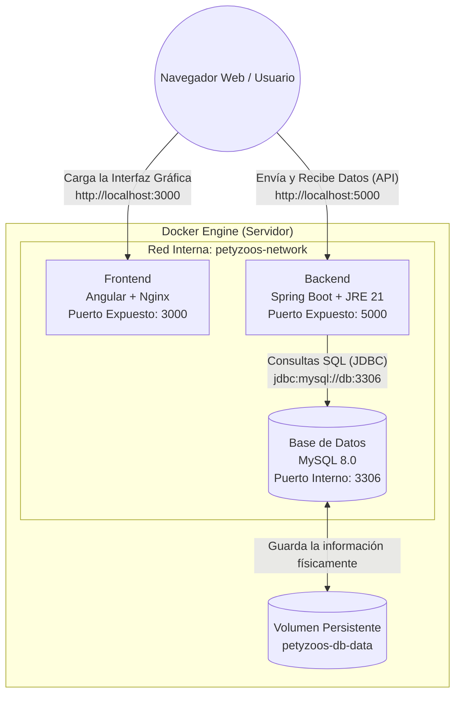

# Arquitectura y Despliegue en Docker - Sistema de Inventarios Petyzoos

Este documento sirve como guía definitiva para entender cómo funciona la arquitectura de contenedores de tu proyecto, cómo se conectan los distintos componentes y qué hace cada línea de configuración.

### Diagrama de Comunicación



---

### ¿Cómo se comunican los contenedores y cómo funciona la Red Privada?

1. **La Red Privada (`inventario-net`)**
   Al levantar el proyecto, Docker no conecta tus contenedores directamente al internet público. En su lugar, crea una **red virtual privada tipo puente (bridge)** exclusiva para tu proyecto. Piensa en esta red como un router WiFi virtual al que solo están conectados el Frontend, el Backend y la Base de Datos. Ningún contenedor externo puede entrar a esta red.

2. **Resolución de Nombres (DNS Interno de Docker)**
   Dentro de esta red privada, Docker asigna automáticamente una dirección IP a cada contenedor, pero las IPs pueden cambiar cada vez que se reinicia el proyecto. Para solucionar esto, Docker incluye un **servidor DNS interno**. Gracias a esto, los contenedores se pueden comunicar usando sus "nombres de servicio" (definidos en el `docker-compose.yml`) en lugar de direcciones IP numéricas.
   - El **Backend** se conecta a la base de datos simplemente llamando a la ruta `jdbc:mysql://db:3306`. Docker automáticamente traduce la palabra `db` a la IP actual del contenedor de MySQL.
   - El **Frontend** (Nginx) se comunica internamente con el Backend usando la ruta del contenedor (aunque en este proyecto específico, como el Frontend corre en el navegador del usuario final, las llamadas a la API se hacen a `http://localhost:5000` que es el puerto expuesto del Backend hacia tu computadora física).

3. **¿Quién aloja a los contenedores? (El mito del "Contenedor Principal")**
   Es común pensar que hay un "contenedor principal" gigante que tiene a los demás adentro, pero no es así. En realidad, quien aloja y maneja a todos los contenedores es el **Docker Engine** (el motor de Docker instalado en tu computadora o servidor físico). 
   - El **Docker Compose** no es un contenedor, sino una *herramienta de orquestación*. Funciona como el "director de orquesta" que lee las instrucciones y le dice al Docker Engine: *"Crea esta red, levanta la base de datos, luego el backend y finalmente el frontend, y conéctalos todos a la misma red"*. Todos los contenedores corren como procesos paralelos al mismo nivel, compartiendo los recursos (CPU y RAM) del servidor físico que los hospeda (Host).

### Persistencia de la Información
- **Volúmenes (`db-data`)**: Los contenedores son efímeros (si se borran o actualizan, se pierde todo su contenido interno). Para evitar que los datos de MySQL desaparezcan al apagar el contenedor, se usa un **Volumen**. Un volumen es un disco virtual que Docker crea y guarda de forma permanente y segura en tu disco duro físico, vinculándolo al contenedor de la base de datos.

---

## 2. Levantando el Proyecto (`docker-compose.yml`)

El archivo `docker-compose.yml` es el **director de orquesta**. Su trabajo es leer la configuración y levantar todos los contenedores en el orden correcto.

> [!TIP]
> **Comando Principal**
> Para levantar todo el proyecto, debes abrir una terminal en la carpeta principal y ejecutar:
> ```bash
> docker compose up -d --build
> ```
> - **`up`**: Crea e inicia los contenedores.
> - **`-d`**: *Detached mode*, deja los contenedores corriendo en segundo plano.
> - **`--build`**: Obliga a reconstruir las imágenes si hubo cambios en el código.

### ¿En qué orden se levantan?
Gracias a la propiedad `depends_on`, Docker Compose sabe exactamente qué levantar primero:
1. Nace la **Base de datos (`db`)**.
2. El **Backend** espera hasta que la Base de datos esté sana y responda a las pruebas de conexión (*healthcheck*). Luego, arranca el Backend.
3. El **Frontend** espera a que el Backend haya arrancado para encenderse.

---

## 3. Explicación línea por línea de los Archivos Docker

A continuación, analizamos a fondo qué hace cada archivo que construye tu proyecto.

### A. Frontend (Angular) - `frontend-inventario/Dockerfile`
Utiliza **Multi-stage build**. Esto significa que primero usa una computadora con Node.js para compilar (ensamblar) el código, y luego bota esa computadora y solo se queda con el HTML/CSS resultante metido en un servidor web ultraligero (Nginx).

```dockerfile
# ===========================================================
# DOCKERFILE FRONTEND - Sistema de Inventarios Petyzoos
# Multi-stage build: Angular 21 → Nginx Alpine
# ===========================================================

# ── STAGE 1: BUILD ──────────────────────────────────────────
# Usamos node:22-alpine como imagen base para compilar Angular.
# Alpine reduce el tamaño de imagen significativamente vs Debian.
FROM node:22-alpine AS build

# Directorio de trabajo dentro del contenedor
WORKDIR /app

# Copiamos primero package.json y package-lock.json para aprovechar
# la caché de Docker layers. Si no cambian, npm ci no se re-ejecuta.
COPY package.json package-lock.json ./

# Instalamos dependencias sin caché innecesario (--no-cache)
# npm ci es más rápido y determinista que npm install
RUN npm ci --no-audit --no-fund

# Ahora copiamos el resto del código fuente
COPY . .

# Compilamos la aplicación Angular en modo producción
# Esto genera archivos estáticos en dist/frontend-inventario/browser/
RUN npx ng build --configuration production

# ── STAGE 2: PRODUCCIÓN ────────────────────────────────────
# Usamos nginx:alpine para servir los archivos estáticos.
# La imagen de nginx:alpine pesa ~40MB vs ~140MB de nginx:latest
FROM nginx:alpine AS production

# Copiamos la configuración personalizada de Nginx
COPY nginx.conf /etc/nginx/conf.d/default.conf

# Copiamos los archivos compilados de Angular desde el stage anterior
# Angular 21 genera los archivos en dist/<nombre-proyecto>/browser/
COPY --from=build /app/dist/frontend-inventario/browser /usr/share/nginx/html

# Exponemos el puerto 80 (Nginx)
EXPOSE 80

# Comando por defecto para ejecutar Nginx en primer plano
CMD ["nginx", "-g", "daemon off;"]
```

### B. Backend (Spring Boot) - `backend/Dockerfile`
Al igual que el Frontend, utiliza múltiples etapas para no enviar al servidor final herramientas de compilación pesadas, reduciendo el tamaño de la imagen.

```dockerfile
# ===========================================================
# DOCKERFILE BACKEND - Sistema de Inventarios Petyzoos
# Multi-stage build: Maven + JDK 21 → JRE 21 Alpine
# ===========================================================

# ── STAGE 1: BUILD ──────────────────────────────────────────
# Usamos maven con Eclipse Temurin JDK 21 para compilar
FROM maven:3.9-eclipse-temurin-21-alpine AS build

# Directorio de trabajo
WORKDIR /app

# Copiamos primero pom.xml para aprovechar caché de dependencias
COPY pom.xml .
COPY .mvn .mvn
COPY mvnw .

# Descargamos dependencias sin compilar el código (cache de layers)
RUN mvn dependency:go-offline -B

# Copiamos el código fuente
COPY src ./src

# Compilamos el proyecto, saltando tests para agilizar el build
# --no-transfer-progress reduce la salida del log
RUN mvn clean package -DskipTests --no-transfer-progress

# ── STAGE 2: PRODUCCIÓN ────────────────────────────────────
# Usamos JRE Alpine para reducir el tamaño final (~200MB vs ~600MB)
FROM eclipse-temurin:21-jre-alpine AS production

# Directorio de trabajo
WORKDIR /app

# Creamos usuario no-root para seguridad
RUN addgroup -S appgroup && adduser -S appuser -G appgroup

# Copiamos el JAR compilado desde el stage de build
COPY --from=build /app/target/*.jar app.jar

# Cambiamos permisos del JAR al usuario no-root
RUN chown appuser:appgroup app.jar

# Cambiamos al usuario no-root
USER appuser

# Exponemos el puerto del backend (Spring Boot)
EXPOSE 8080

# HEALTHCHECK: Verifica que el backend responda cada 30 segundos
# Se usa wget porque curl no está disponible en Alpine por defecto
HEALTHCHECK --interval=30s --timeout=10s --start-period=60s --retries=3 \
    CMD wget --no-verbose --tries=1 --spider http://localhost:8080/api/dashboard || exit 1

# Comando de ejecución con perfil Docker activado
CMD ["java", "-jar", "app.jar", "--spring.profiles.active=docker"]
```

### C. Archivo `docker-compose.yml` (Orquestación y Base de Datos)
La base de datos **no necesita un Dockerfile** porque no compilamos código propio; solo configuramos la imagen oficial de MySQL. Todo, junto con la conexión de los servicios, se define en el archivo principal `docker-compose.yml`:

```yaml
# ================================================================
# DOCKER COMPOSE - Sistema de Inventarios Petyzoos
# Orquesta 3 servicios: frontend, backend y base de datos MySQL
# Versión mínima: 3.8
# ================================================================
services:
  # ─── FRONTEND (Angular + Nginx) ─────────────────────────────
  frontend:
    build:
      context: ./frontend-inventario
      dockerfile: Dockerfile
    container_name: petyzoos-frontend
    ports:
      - "${FRONTEND_PORT:-3000}:80"     # Publica puerto 3000 → Nginx:80
    depends_on:
      - backend                          # Espera a que backend inicie
    networks:
      - inventario-net                   # Red personalizada
    restart: unless-stopped

  # ─── BACKEND (Spring Boot + JRE 21) ────────────────────────
  backend:
    build:
      context: ./backend
      dockerfile: Dockerfile
    container_name: petyzoos-backend
    ports:
      - "${BACKEND_PORT:-5000}:8080"    # Publica puerto 5000 → Spring:8080
    env_file:
      - .env                            # Variables de entorno desde archivo
    environment:
      - SPRING_PROFILES_ACTIVE=docker   # Activa perfil Docker
    depends_on:
      db:
        condition: service_healthy       # Espera a que MySQL pase healthcheck
    networks:
      - inventario-net
    restart: unless-stopped
    healthcheck:
      test: ["CMD", "wget", "--no-verbose", "--tries=1", "--spider", "http://localhost:8080/api/dashboard"]
      interval: 30s
      timeout: 10s
      start_period: 90s
      retries: 3

  # ─── BASE DE DATOS (MySQL 8) ───────────────────────────────
  db:
    image: mysql:8.0                     # Imagen oficial de MySQL
    container_name: petyzoos-db
    env_file:
      - .env
    environment:
      MYSQL_ROOT_PASSWORD: ${DB_ROOT_PASS}
      MYSQL_DATABASE: ${DB_NAME}
      MYSQL_USER: ${DB_USER}
      MYSQL_PASSWORD: ${DB_PASS}
    ports:
      - "${DB_PORT:-3306}:3306"          # Publica puerto 3306
    volumes:
      - db-data:/var/lib/mysql           # Volumen persistente para datos
      - ./db/init.sql:/docker-entrypoint-initdb.d/init.sql  # Script de inicialización
    networks:
      - inventario-net
    restart: unless-stopped
    healthcheck:
      test: ["CMD", "mysqladmin", "ping", "-h", "localhost", "-u", "root", "-p${DB_ROOT_PASS}"]
      interval: 15s
      timeout: 10s
      start_period: 30s
      retries: 5
    command: --default-authentication-plugin=caching_sha2_password

# ─── VOLÚMENES NOMBRADOS ─────────────────────────────────────
volumes:
  db-data:
    name: petyzoos-db-data               # Nombre explícito del volumen

# ─── REDES PERSONALIZADAS ────────────────────────────────────
networks:
  inventario-net:
    name: petyzoos-network               # Nombre explícito de la red
    driver: bridge                       # Driver de red bridge
```

> [!NOTE]
> **Resumen del Flujo de Trabajo**
> Todo el proceso automatizado te evita tener que instalar software manualmente. Solo con el comando de Docker Compose, el sistema descarga dependencias, compila el Frontend, empaqueta el Backend, crea la Base de datos con sus tablas listas y conecta a los tres servicios de forma segura.
