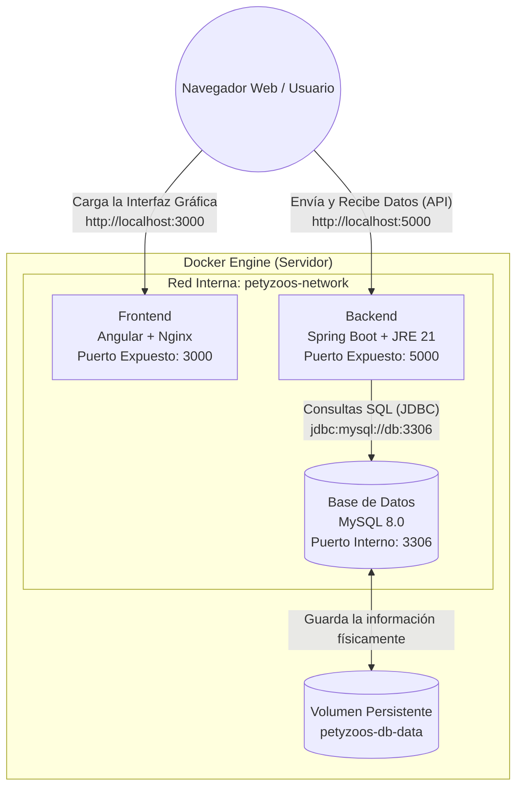

# Arquitectura y Despliegue en Docker - Sistema de Inventarios Petyzoos

Este documento es la guía definitiva de tu laboratorio para el curso de Arquitectura de Sistemas Operativos. Detalla cómo funciona la arquitectura de contenedores, la conexión entre componentes y el código fuente de cada archivo de configuración.

## 1. Arquitectura General del Sistema

El sistema utiliza una arquitectura de microservicios contenerizados y orquestados mediante **Docker Compose**. Cada componente opera de forma aislada dentro de su propio contenedor, comunicándose a través de una red privada denominada `petyzoos-network`.

### Diagrama de Comunicación



* **Red Aislada**: Permite que el Backend se conecte a la base de datos usando el nombre del servicio `db` gracias al DNS interno de Docker.
* **Persistencia**: Se utiliza un volumen nombrado (`petyzoos-db-data`) para asegurar que los datos de la clínica no se pierdan al apagar los contenedores.

---

## 2. Archivos de Configuración (Código Completo)

Copia cada bloque de código en su respectivo archivo dentro de la carpeta de tu proyecto.

### A. Orquestador: `docker-compose.yml` (Raíz)
```yaml
services:
  frontend:
    build: ./frontend-inventario
    container_name: petyzoos-frontend
    ports: ["3000:80"]
    depends_on: [backend]
    networks: [inventario-net]
    restart: unless-stopped
  
  backend:
    build: ./backend
    container_name: petyzoos-backend
    ports: ["5000:8080"]
    env_file: .env
    environment:
      SPRING_PROFILES_ACTIVE: docker
    depends_on:
      db:
        condition: service_healthy
    networks: [inventario-net]
    restart: unless-stopped
    healthcheck:
      test: ["CMD", "wget", "--spider", "http://localhost:8080/api/dashboard"]
      interval: 30s
      timeout: 10s
      start_period: 90s
  
  db:
    image: mysql:8.0
    container_name: petyzoos-db
    env_file: .env
    environment:
      MYSQL_ROOT_PASSWORD: ${DB_ROOT_PASS}
      MYSQL_DATABASE: ${DB_NAME}
      MYSQL_USER: ${DB_USER}
      MYSQL_PASSWORD: ${DB_PASS}
    volumes:
      - db-data:/var/lib/mysql
      - ./db/init.sql:/docker-entrypoint-initdb.d/init.sql
    networks: [inventario-net]
    healthcheck:
      test: ["CMD", "mysqladmin", "ping", "-h", "localhost", "-u", "root", "-p${DB_ROOT_PASS}"]
      interval: 15s
      start_period: 30s
      retries: 5

volumes:
  db-data:
    name: petyzoos-db-data

networks:
  inventario-net:
    name: petyzoos-network
    driver: bridge
```

### B. Frontend: `frontend-inventario/Dockerfile`
```dockerfile
# STAGE 1: Compilar Angular con Node.js
FROM node:22-alpine AS build
WORKDIR /app
COPY package.json package-lock.json ./
RUN npm ci --no-audit --no-fund
COPY . .
RUN npx ng build --configuration production

# STAGE 2: Servir con Nginx Alpine
FROM nginx:alpine AS production
COPY nginx.conf /etc/nginx/conf.d/default.conf
COPY --from=build /app/dist/frontend-inventario/browser /usr/share/nginx/html
EXPOSE 80
CMD ["nginx", "-g", "daemon off;"]
```

### C. Backend: `backend/Dockerfile`
```dockerfile
# STAGE 1: Build con Maven + JDK 21
FROM maven:3.9-eclipse-temurin-21-alpine AS build
WORKDIR /app
COPY pom.xml .
COPY .mvn .mvn
COPY mvnw .
RUN mvn dependency:go-offline -B
COPY src ./src
RUN mvn clean package -DskipTests --no-transfer-progress

# STAGE 2: Producción con JRE Alpine
FROM eclipse-temurin:21-jre-alpine AS production
WORKDIR /app
RUN addgroup -S appgroup && adduser -S appuser -G appgroup
COPY --from=build /app/target/*.jar app.jar
RUN chown appuser:appgroup app.jar
USER appuser
EXPOSE 8080
HEALTHCHECK --interval=30s --timeout=10s --start-period=60s --retries=3 \
    CMD wget --no-verbose --tries=1 --spider http://localhost:8080/api/dashboard || exit 1
CMD ["java", "-jar", "app.jar", "--spring.profiles.active=docker"]
```

### D. Base de Datos: `db/init.sql`
```sql
CREATE DATABASE IF NOT EXISTS DB_Inventario CHARACTER SET utf8mb4 COLLATE utf8mb4_unicode_ci;
GRANT ALL PRIVILEGES ON DB_Inventario.* TO 'petyzoos'@'%';
FLUSH PRIVILEGES;
```

### E. Entorno: `.env` (Raíz)
```env
DB_NAME=DB_Inventario
DB_USER=petyzoos
DB_PASS=PetyzoosSecure2026
DB_ROOT_PASS=TuRootPassSecure2026
JWT_SECRET=TuClaveSecretaJWT2026
SPRING_PROFILES_ACTIVE=docker
FRONTEND_PORT=3000
BACKEND_PORT=5000
DB_PORT=3307
```

### F. Filtro Git: `.gitignore`
```gitignore
.env
target/
*.class
node_modules/
.angular/
.vscode/
.idea/
```

---

## 3. Guía de Despliegue

Para levantar todo el sistema Petyzoos, ejecuta el siguiente comando en la raíz del proyecto:
```bash
docker compose up -d --build
```

**Verificación**:
1.  **Frontend**: Accede a `http://localhost:3000`.
2.  **API/Backend**: Accede a `http://localhost:5000/api/auth/login`.
3.  **Estado**: Usa `docker compose ps` para confirmar que los tres servicios estén `Up (healthy)`.

> **Resumen del Flujo**: El sistema descarga dependencias, compila Angular y Java mediante builds multietapa, e inicializa la base de datos de forma automática, garantizando un entorno de producción optimizado y seguro.
